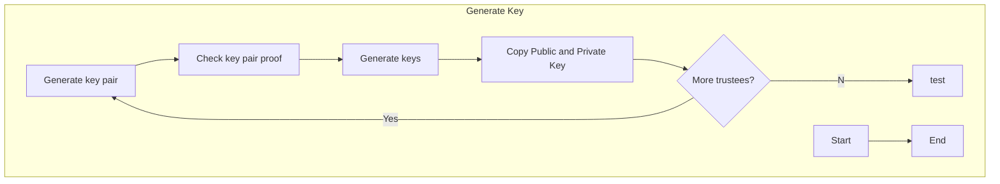
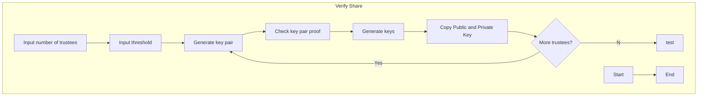

# Key Ceremony

In accordance with **Specification v.0.85**

```mermaid
stateDiagram
    state GenerateKey{

    }
    [*] --> Still
    Still --> [*]

    Still --> Moving
    Moving --> Still
    Moving --> Crash
    Crash --> [*]


```






Decide on n trustees
Decide on k threshold

Each Trustee generates a public-private key pair

PrivateKeyShare

The public keys are then all combined into single public key to encrypt the selections of the votes


each trustee must share a part of their private key


Each trustee has shared public encryption Ei with the group


Trustee generates k polynomial coefficients.

Trustee then publishes k commitments for each of its random polynomial coefficients. 
The constant term serves as private key
K


Trustees have to publically report a computation
- if trustee fails to produce a suitable pil and nonce that match both the published encryptiong it should be expluded from the election. Key generation should be restarted with alternate trustee


Each Key Ceremony includes each verification of the trustee of the public keys